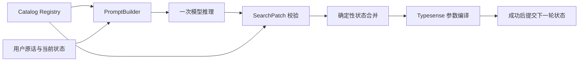

# Baking SearchPatch 参数抽取

将用户对烘焙酱料的自然语言需求转成固定结构的 SearchPatch，由确定性代码合并搜索状态、生成 Typesense 查询参数。
项目提供 Qwen3 0.6B / 1.7B 的数据构建、SFT 配置、评估、GGUF 量化与本地双模型比较界面。

当前完成迁移代码与离线验证，并制备、冻结 200 条烘焙合成评估样本（AI 起草和复核，独立人工审核待完成）。
训练语料、烘焙 adapter 和 GGUF 尚未产生，烘焙基线未运行；历史预约模型的分数不代表本业务效果。
Task 09 的 Search DPO 暂缓，SFT builder 明确拒绝启用 DPO。

## 架构



`configs/catalog/registry.yaml` 是字段、枚举、单位、层级与索引映射的业务事实源。
模型只接收 system 规则、Registry 摘要、当前 SearchState 和用户原话。
样本 ID、标签、场景及评分断言用于数据和评估，不进入抽取 Prompt。

SearchPatch 固定包含 `schema_version`、`reset`、`hard_filters`、`soft_preferences`、`clear_fields`、`query_text`、`sort`、`unmapped_terms`。
普通更新替换本轮涉及的字段，保留其他字段；`clear_fields` 显式清除，`reset` 重置后应用新条件。
硬过滤进入 Typesense `filter_by`，软偏好作为独立 `ranking_hints` 返回。
解析、校验、合并或查询编译失败时，比较界面保留之前的状态。

## 环境与快速验证

推荐 Python 3.12+；项目及开发依赖记录在 `pyproject.toml` / `uv.lock`。
以下命令从仓库根目录运行，PowerShell 示例使用 uv 管理环境。

```powershell
uv sync --group dev
$env:PYTHONPATH = "$PWD/src;$PWD"
uv run python -m pytest
```

默认运行搜索主线与共用基础设施测试，不收集归档预约测试，不启动真实模型服务器。
若直接使用已安装依赖的 Python，以下 `uv run python` 可替换为 `python`。

离线检查生成配额、SFT 计划及量化路径：

```powershell
uv run python -m scripts.data.generate_search_raw --config configs/data/baking_search_v1.yaml --dry-run
uv run python -m scripts.data.build_dataset --config configs/data/baking_search_v1.yaml --dry-run
uv run python -m scripts.quantize.build_search --dry-run
```

dry-run 不调用生成模型、不训练，也不证明正式输入已经齐备。
当前生成计划为 1,820 条、15 类场景；量化 dry-run 显示工具和校准文件是否存在。

## 数据流程

先独立设计、审核并冻结 `data/eval/baking-v1.0/test.jsonl`，再生成训练 Raw。
当前已固定 baking-v1.0 的 200 条合成评估样本，覆盖 15 类场景和 14 个可抽取字段。
冻结表示版本内容固定，不代表独立人工审核或模型验收通过；逐步制作与复核依据见 [九步制作记录](docs/baking-frozen-eval-v1/README.md)。
Raw / Eval 使用 `id/scenario/tags/input/expected/assertions` 六个字段。
`input` 仅包含 `current_search_state` 和 `user_input`；`expected` 为完整 SearchPatch。

校验正式评估集：

```powershell
uv run python -m scripts.eval.validate_dataset
uv run python -m scripts.eval.verify_frozen_search_eval
```

默认校验器使用 baking Eval 与 Catalog Registry；空数据、预约协议或非法 Gold 均失败。
`tests/fixtures/baking_search_smoke.jsonl` 是开发 smoke fixture，不是正式 Frozen Eval。

生成与构建需要先配置可用的生成后端：

```powershell
uv run python -m scripts.data.generate_search_raw --config configs/data/baking_search_v1.yaml --strict-audit
uv run python -m scripts.data.build_dataset --config configs/data/baking_search_v1.yaml --raw-input data/raw/baking-v1.0/samples.jsonl --strict-audit
```

生成支持 checkpoint 恢复、严格 JSON 校验、配额与覆盖审计。
构建检查评估隔离、重复输入、版本保护，按场景和单/多轮形态分层切分 train/val。
同一归一化用户原话即使状态不同也按潜在重叠处理；近义改写需人工检查。
结构和覆盖通过后，仍須审核 Gold 与自然语言需求的一致性。

主要产物：

| 产物 | 路径 |
| --- | --- |
| Raw | `data/raw/baking-v1.0/samples.jsonl` |
| SFT train / val | `data/processed/sft/baking-v1.0/{train,val}.jsonl` |
| LLaMA-Factory 注册 | `data/processed/baking-v1.0/dataset_info.json` |
| 构建来源与 hash | `data/processed/baking-v1.0/manifest.json` |
| 正式独立评估 | `data/eval/baking-v1.0/test.jsonl` |

`data/dataset-registry.yaml` 管理 dataset ID、状态、parent 和路径。
评估条目已更新为 `frozen`，记录 SHA256、来源、AI 审核边界和基线暂缓状态；Raw / SFT 条目仍为 `planned`。
修订正式数据使用新版本，不覆盖冻结版本。

## SFT 训练

两模型使用相同 SFT 数据与独立 Frozen Eval。
训练环境按 `requirements-train.txt` 安装；设备兼容性与长上下文显存需求需在训练机器验证。
将 override 与基础配置合并，再检查实际 tokenizer 的完整 train/val 预算：

```powershell
uv run python -m scripts.train.render_config --run-id baking-qwen3-0.6b
uv run python -m scripts.train.render_config --run-id baking-qwen3-1.7b
uv run python -m scripts.train.check_search_data --run-id baking-qwen3-0.6b
uv run python -m scripts.train.check_search_data --run-id baking-qwen3-1.7b
```

预检使用本地缓存 tokenizer，支持 `--tokenizer` 指定路径；超限直接失败。
训练使用渲染后的完整配置：

```powershell
llamafactory-cli train configs/training/llamafactory/_rendered/baking-qwen3-0.6b.yaml
llamafactory-cli train configs/training/llamafactory/_rendered/baking-qwen3-1.7b.yaml
```

Adapter 输出为 `models/adapters/baking-search-qwen3-{0.6,1.7}b-sft-v1`。
初始配置使用 LoRA rank 16、cutoff 8192、packing=false；预算以实际数据预检为准。
历史 renderer 的 `--all` / `run_matrix.sh` 属于预约实验；搜索训练显式选择上述 run ID。

## 量化与服务器

`configs/quantization/baking_search_v1.yaml` 包含两个 Q4_K_M 目标和两个对应 F16 anchor。
`data/calibration/baking-search-v1.txt` 从审核后的 SFT train 制备，不能使用 val / Frozen Eval。
构建需要本地对应 revision 的完整 Qwen 权重、训练 adapter 与 llama.cpp 工具：

```powershell
uv run python -m scripts.quantize.build_search --dry-run
uv run python -m scripts.quantize.build_search
```

Manifest 记录 adapter、校准文件和 GGUF hash；指定 revision 缓存缺失时直接失败。
搜索版本拒绝复用已有输出；失败后的部分产物需先检查，再使用新版本或显式处理。
产物 hash 验证不代表质量验收通过。

分别在两个终端启动评估服务器：

```powershell
uv run python -m slot_extractor.inference.llama_server_manager --config configs/quantization/baking_search_v1.yaml --server deployment/llama_cpp/bin/llama-server.exe --model-id baking-search-qwen3-0.6b-sft-v1-q4-k-m --port 8080
uv run python -m slot_extractor.inference.llama_server_manager --config configs/quantization/baking_search_v1.yaml --server deployment/llama_cpp/bin/llama-server.exe --model-id baking-search-qwen3-1.7b-sft-v1-q4-k-m --port 8081
```

## 评估与门槛

```powershell
uv run python -m scripts.eval.run_eval --config configs/evaluation/baking_search_v1.yaml --model baking-qwen3-0.6b
uv run python -m scripts.eval.run_eval --config configs/evaluation/baking_search_v1.yaml --model baking-qwen3-1.7b
```

两模型共享 Frozen Eval 路径，配置模式禁止临时覆盖 cases / Registry / backend。
报告记录输入与配置 hash、原始输出、逐例断言、合并状态、场景切片和时延。
不同实验使用不同 `--report-dir`，避免覆盖同一模型报告。

硬门槛为 Schema Valid 100%、Allergen Semantics 100%、未知字段和未知值各 0%。
未知字段/值检查覆盖全部响应；没有适用样本的门槛不通过。
同时检查提取、硬软条件、否定、状态保持、幻觉和最小 Patch，不以单一 exact-match 决定上线。
退出码：0 为本次门槛通过，2 为评估完成但未通过，1 为执行失败。

## 双模型比较界面

```powershell
uv run python -m uvicorn slot_extractor.search_compare.app:create_app --factory --host 127.0.0.1 --port 8000
```

打开 `http://127.0.0.1:8000`，选择并加载左右模型，再执行单轮或多轮需求。
界面展示原始输出、Patch、校验、状态 diff、编译参数和推理指标，可导出 JSON。
默认顺序比较；并行模式的性能数字不能直接作为相同条件的速度结论。
尚未构建的模型显示不可用；左右状态可重置或同步。
完整 API 与状态语义见 [Search Compare](docs/search-compare.md)。

## 测试与历史归档

```powershell
uv run python -m pytest
uv run python -m pytest -m "legacy and not local_backend"
uv run python -m pytest -m "not local_backend"
uv run python -m pytest tests/integration/test_pipeline_llama_server.py -m local_backend
```

分别运行搜索主线、历史预约、两者离线全量、真实烘焙服务器 smoke。
真实 smoke 使用开发 fixture，不替代两模型的正式 Frozen Eval。
预约 / reply / technician 测试、数据和报告保留，通过 marker 与 legacy 入口隔离。
旧 `slot-*` 命令保留兼容别名，默认行为已是搜索业务。
Python 包名 `slot_extractor` 保留，避免破坏安装和历史复现。

## 文档

| 内容 | 文档 |
| --- | --- |
| 目录与职责 | [项目结构](docs/project-structure.md) |
| 业务事实源 | [Catalog Registry](docs/catalog-registry.md) |
| 协议与状态 | [Search schema](docs/search-schema.md)、[Runtime](docs/search-runtime.md) |
| Raw / Eval | [数据合同](docs/search-dataset-contract.md) |
| Frozen Eval 制作与审核 | [九步制作记录](docs/baking-frozen-eval-v1/README.md)、[数据卡](data/eval/baking-v1.0/DATASET_CARD.md) |
| 生成与 SFT | [生成](docs/search-generation.md)、[构建](docs/search-dataset-build.md) |
| Prompt / Eval | [Prompt](docs/search-prompts.md)、[评估](docs/search-evaluation.md) |
| 训练与量化配置 | [模型配置](docs/search-model-configs.md) |
| 审查与迁移验收 | [Task 12 迁移记录](docs/search-migration-notes.md) |
| 历史复现 | [预约 README 归档](docs/archive/appointment-readme.md) |
